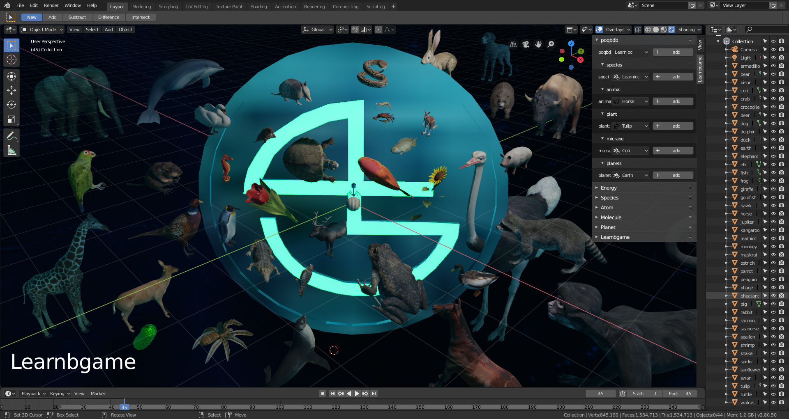
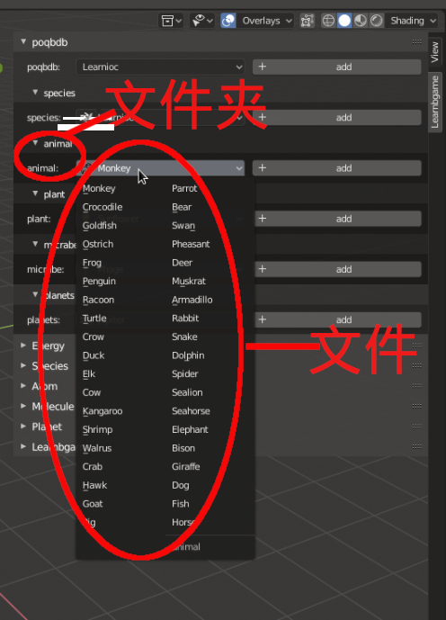

# poqbdb

poqbdb is process or query by database

blender 模型管理插件poqbdb(process or query by database的缩写)

插件托管在 https://github.com/BlenderCN/poqbdb

随着blender学习的深入和工作的需要,我们可能会接触或创建出大量模型,而随着模型的逐渐增多,管理这些模型就会成为比较麻烦的事,所以我就想着写一个插件,来管理模型.插件主要有两部分,poqbdb文件夹,逻辑脚本__init__.py和poqbdb.py

	poqbdb
		|
		|---poqbdb
		|
		|---__init__.py
		|
		|---draw_class.py
		|---poqbdb.py

只要你将你的模型以gltf格式放入poqbdb文件夹,就能自动在软件界面形成相应的按钮,到时候就能很方便通过一键生成你自己的模型

关于gltf格式的问题:目前只采用gltf的格式进行导入,关于gltf格式可以参考 https://github.com/KhronosGroup/glTF
可能有些人喜欢.obj或.fbx或其他格式的导入方式,只需要在脚本
将bpy.ops.import_scene.gltf()改为bpy.ops.import_scene.obj()或	其他对应命令即可.

插件UI

Q&A

关于gltf格式的问题:

	目前只采用gltf的格式进行导入,关于gltf格式可以参考: 												       https://github.com/KhronosGroup/glTF,
	可能有些人喜欢.obj或.fbx或其他格式的导入方式,只需要在脚本将bpy.ops.import_scene.gltf()	改为bpy.ops.import_scene.obj()或其他对应命令即可.

关于bug或其他:
	
	由于精力和能力有限,插件可能会出现一些bug,后期会逐渐改进,欢迎提issue和bug,敬请期待.

插件模型来源于free3d.com,仅供学习

安装教程[wiki](https://github.com/BlenderCN/poqbdb/wiki)
